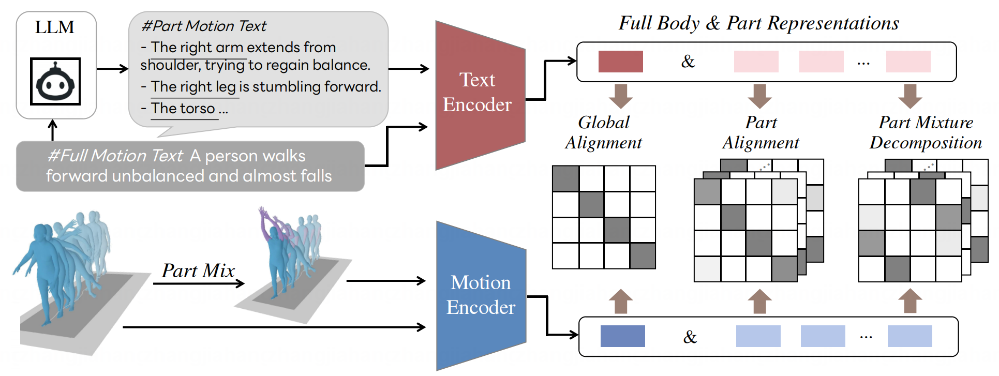

# Motion Patches

Code of the paper "SGAR: Structural Generative Augmentation for 3D Human Motion Retrieval" (NeurIPS 2025).

[](https://openreview.net/pdf/1d98cebdbc17f9dacf4861cfbd15a16f71dd3e8a.pdf)
<a href='https://jhang2020.github.io/Projects/SGAR/SGAR.html'></a>


## Framework



## Requirements
- Python 3.11
- PyTorch 2.0.1+


#### Prepare Your Environment
```bash
pip install -r requirements.txt
```

## Data Preparation
Download HumanML3D Dataset and KIT-ML Dataset from the repository of [HumanML3D](https://github.com/EricGuo5513/HumanML3D#humanml3d-3d-human-motion-language-dataset).

Download the Part Texts generated by LLM from [huggingface](https://huggingface.co/Jiahang-HF/SGAR).

Unzip and locate them in the `data` folder.

The whole directory should be look like this:
```
SGAR
│   README.md
│   requirements.txt
|   ...
|
└───conf
└───scripts
└───...
│   
└───data
    └───HumanML3D
    |   └───new_joint_vecs
    |   └───new_joints
    |   └───part_texts
    |   └───...
    │   
    └───KIT-ML
        └───new_joint_vecs
        └───new_joints
        └───part_texts
        └───...
```
Then calculate the mean and variance of each dataset by:
```bash
python scripts/cal_mean_var.py
```

## Pre-trained Model
Download pre-trained model from [huggingface](https://huggingface.co/Jiahang-HF/SGAR) and put them in `checkpoints/pretrained/`.

Evaluate the model with HumanML3D via retrieval:
```bash
python scripts/test.py dataset=HumanML3D exp_name=pretrained
```

Evaluate the model with KIT-ML via retrieval:
```bash
python scripts/test.py dataset=KIT-ML exp_name=pretrained
```

## Training
Train the model with HumanML3D:
```bash
python scripts/train.py dataset=HumanML3D
```

Train the model with KIT-ML:
```bash
python scripts/train.py dataset=KIT-ML
```

## Evaluation
Evaluate the model via retrieval:
```bash
python scripts/test.py dataset=HumanML3D
```
```bash
python scripts/test_all_proto.py dataset=HumanML3D
```

## Citation

```
@inproceedings{zhangsgar2024,
  title={SGAR: Structural Generative Augmentation for 3D Human Motion Retrieval},
  author={Zhang, Jiahang and Lin, Lilang and Yang, Shuai and Liu, Jiaying},
  booktitle={NeurIPS},
  year={2025}
}
```

## Acknowledgement
We sincerely thank the authors for releasing the code of their valuable works. Our code is built based on the  [MotionPatch](https://github.com/line/MotionPatches).

## Licence
This project is licensed under the terms of the MIT license.